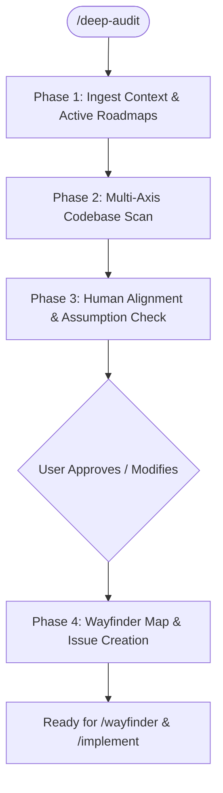

# Deep Audit

A deep, multi-dimensional repository audit that assesses the entire codebase for architectural coherence, code deduplication, streamlining opportunities, frontend/backend hygiene, and agent/widget contract integrity.

This skill works hand-in-hand with the **Matt Pocock skill suite**, `CONTEXT.md`, `docs/adr/`, `docs/agents/issue-tracker.md`, and `/wayfinder` / `/to-tickets`.

---

## Core Principles

1. **Context & Roadmap Aware**: Never audit in a vacuum. Always read `CONTEXT.md`, ADRs in `docs/adr/`, and active Wayfinder maps (`gh issue list --label wayfinder:map`) before scanning, so you never re-litigate settled decisions or duplicate in-flight roadmap work.
2. **Public Seams & Deep Modules**: Evaluate code using the `/codebase-design` vocabulary (**module**, **interface**, **depth**, **seam**, **adapter**, **locality**). Seek deep modules with clean, narrow interfaces.
3. **Human-in-the-Loop Alignment First**: Never publish tickets or refactoring issues to the issue tracker without first presenting your findings and assumptions to the human for review, prioritization, and alignment.
4. **Actionable via Tracker**: Turn approved findings into structured Wayfinder maps or tracer-bullet tickets on GitHub with native dependencies and canonical triage labels (`ready-for-agent`, `wayfinder:task`).

---

## Execution Workflow



---

### Phase 1: Ingest Context & Active Roadmaps

Before analyzing code, establish full awareness of the repository's trajectory:

1. **Read Domain Context**: Inspect `CONTEXT.md` for canonical entities and domain terms (e.g. *Athlete Profile*, *Goal Set*, *Telemetry Sample*, *Biomarker Panel*, *Fast Context*, *Interactive Chat Widget*).
2. **Read Architectural Decision Records**: Check `docs/adr/` for locked decisions that should not be challenged unless there is strong evidence of severe friction.
3. **Check Active GitHub Roadmaps**:
   - List active maps: `gh issue list --label wayfinder:map --state open`
   - List open issues: `gh issue list --state open --limit 30`
   - Identify in-flight features to avoid conflicting with ongoing work.

---

### Phase 2: Multi-Axis Codebase Scan

Spawn sub-agents or perform targeted scans across the primary axes:

#### Axis 1: Domain & Architecture Alignment (`CONTEXT.md`)
- Identify legacy or obsolete terminology lingering in the codebase (e.g., legacy hardcoded coach heuristics vs the new `Agent Engine`).
- Check entity boundary adherence: Are telemetry ingestion, biomarker parsing, and fast context retrieval respecting their domain roles?
- Check for shallow modules where interfaces are as complex as implementations.

#### Axis 2: Code Deduplication & Streamlining
- **Backend**:
  - Repeated data transformation/normalization math across integrations (e.g. Garmin vs Strava vs HealthKit normalization).
  - Duplicated Supabase/database query wrappers or auth header extraction.
  - Redundant route helpers and boilerplate.
- **Frontend (`gymbro-frontend-expo`)**:
  - Duplicated API fetch and error-handling utilities.
  - Redundant UI cards, chart wrappers, or duplicate state hooks across screens.
  - Dead code, unused exports, and orphaned components.

#### Axis 3: Frontend Health (Expo / React Native / Web)
- **Navigation Tree**: Check route clarity in `app/` and unhandled deep linking paths.
- **Render Performance**: Identify unmemoized handlers, missing `keyExtractor` logic, or expensive computations inside list renderers.
- **Component Depth**: Detect over-nested cards and styling inconsistencies.

#### Axis 4: Backend Hygiene (Flask / Python)
- **Route & Error Uniformity**: Ensure blueprints return consistent JSON error envelopes (`{"error": "...", "code": ...}`).
- **Schema Contracts**: Verify request/response validation (favoring Pydantic models over raw dictionaries).
- **Transaction Safety**: Check database operations for proper rollback and error-handling semantics.

#### Axis 5: Agent Engine & Interactive Widget Contracts
- **Tool Definitions**: Verify backend tool definitions match their schema definitions and parameter validations.
- **Widget Payloads**: Check that widget payloads returned by agent tools (`plan approval modal`, `macro calculator`, `session editor`) adhere strictly to frontend client widget specs.
- **Fast Context Latency**: Check rolling snapshot assembly logic for potential bottlenecks (target sub-50ms).

---

### Phase 3: Human Alignment & Assumption Check (HITL)

Synthesize discoveries into a clear, prioritized audit review. **Do not create GitHub issues yet.**

Present the findings using this structure:

```markdown
# GYMBro Deep Audit Summary

## Executive Health Scorecard
| Category | Health | Key Opportunity |
| :--- | :--- | :--- |
| **Domain & Architecture** | 🟢/🟡/🔴 | ... |
| **Code Deduplication** | 🟢/🟡/🔴 | ... |
| **Frontend Health** | 🟢/🟡/🔴 | ... |
| **Backend Hygiene** | 🟢/🟡/🔴 | ... |
| **Agent & Widget Contracts**| 🟢/🟡/🔴 | ... |

---

## Discovered Findings & Proposed Changes

### [P0] Critical / Breaking Disconnects
- **Finding**: Description with file links (e.g. [`app/agent/tools.py`](file:///app/agent/tools.py#L40))
- **Proposed Solution**: Concrete fix approach.
- **Assumption to Validate**: *"We assume X should replace Y as per CONTEXT.md. Is this correct?"*

### [P1] Deduplication & Streamlining Opportunities
- **Finding**: ...
- **Proposed Solution**: ...
- **Assumption to Validate**: ...

### [P2] Architectural Polish & Code Cleanliness
- **Finding**: ...
- **Proposed Solution**: ...

---

## Alignment Questions for the Human
1. Are the assumptions listed above aligned with your vision?
2. Which findings should we ticket immediately into the issue tracker?
3. Are any of these findings intentionally deferred or out of scope?
```

**Pause and ask the user for feedback.** Adjust the findings and scope based on their answers.

---

### Phase 4: Wayfinder Map & Issue Creation

Once the user approves the breakdown:

1. **Create a Wayfinder Map (if large multi-session effort)**:
   ```bash
   gh issue create --title "[Audit] GYMBro Codebase Health & Streamlining Milestone" --label "wayfinder:map" --body "## Destination\nResolve confirmed audit findings to streamline codebase and align with CONTEXT.md\n\n## Decisions so far\n\n## Not yet specified\n"
   ```
2. **Create Child / Tracer-Bullet Tickets**:
   - Use `/to-tickets` rules: vertical slices, narrow scope, single context window size.
   - For each approved finding, create an issue:
     ```bash
     gh issue create --title "<Title>" --body "## What to build\n...\n\n## Acceptance criteria\n- [ ] ...\n\n## Blocked by\n..." --label "ready-for-agent,wayfinder:task"
     ```
3. **Wire Native Dependencies**:
   - Set blocker dependencies per `docs/agents/issue-tracker.md` using `gh api repos/<owner>/<repo>/issues/<child>/dependencies/blocked_by`.
4. **Present the Active Frontier**:
   - Output the unblocked tickets ready for immediate execution via `/implement` and `/tdd`.
