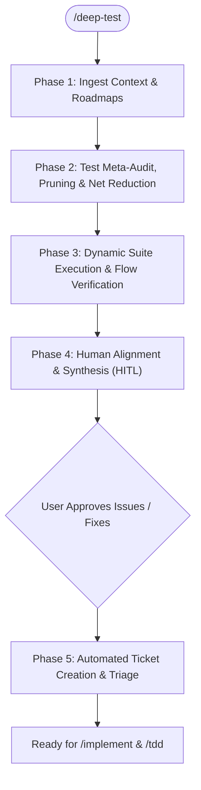

# Deep Test

An advanced, multi-phase testing and verification skill with a **dual mandate**:
1. **Net Reduction & Bloat Pruning**: Actively delete redundant, tautological, over-mocked, and slow duplicate tests to keep the suite lean, fast, and high-signal.
2. **Critical Gap Detection & Resolution**: Identify untested public domain seams (auth negative paths, multi-tenant isolation, widget action round-trips) and either fix them directly or file tracked GitHub issues.

---

## Core Principles

1. **Net Deletion Over Test Accumulation**: Adding 10 new tests without deleting 5 redundant ones leads to test bloat and slow feedback loops. A high-confidence test suite is as small and fast as possible while covering 100% of real domain behavior.
2. **Delete Fake & Tautological Tests**:
   - **Delete Fake "E2E" Tests**: Remove tests labeled "E2E" that are 100% mocked with multiple `patch` decorators.
   - **Delete Tautological Tests**: Remove tests that mock the function under test and merely assert the mock was called.
   - **Delete Mock Internals Tests**: Remove tests that assert internal dictionary keys of mock classes (`MockSupabaseClient`).
   - **Consolidate Duplicate Flows**: Remove separate integration files that repeat the exact same registration/chat/interview sequences.
3. **Public Seam Focus (`/tdd`)**: Every surviving test must target a public domain boundary, route contract, or vertical slice rather than private internals, ensuring resilience against refactoring.
4. **Mock Realism**: Mocks must accurately reflect current schemas and failure paths (429 rate limits, timeouts, malformed inputs).
5. **Human Alignment Before Issue Filing**: Review diagnostics, net deletions, and proposed issues with the human before touching the tracker.

---

## Execution Workflow



---

### Phase 1: Ingest Context & Active Roadmaps

1. **Review Domain Model**: Read `CONTEXT.md` to identify core entities (*Athlete Profile*, *Goal Set*, *Telemetry Sample*, *Biomarker Panel*, *Calendar Session*, *Fast Context*, *Interactive Chat Widgets*).
2. **Review Active Issues & Roadmaps**:
   - Run `gh issue list --state open` to identify in-flight features.
   - Respect settled ADRs in `docs/adr/`.

---

### Phase 2: Test Meta-Audit, Pruning & Net Reduction

Inspect existing tests across `tests/unit/`, `tests/integration/`, `tests/e2e/`, and frontend test configurations.

#### 1. The Net Deletion Sweep (Pruning Bloat)
Identify and delete candidate tests that add maintenance drag without providing unique safety:
- **Heavily Mocked "E2E" Tests**: Replace or delete with real vertical tracer-bullets.
- **Duplicate Flow Tests**: Identify files testing identical endpoints with minor parameter variations; consolidate into parameterized fixtures.
- **Shallow Constant Checks**: Delete tests asserting static strings in dictionaries; replace with behavior verification.

#### 2. The Critical Gap Sweep (High-Value Coverage)
Identify genuine blind spots:
- **Auth & Multi-Tenant Isolation**: Verify Athlete A cannot read/mutate Athlete B's data across all endpoints.
- **Negative & Error Paths**: Unauthenticated access, expired JWTs, duplicate registrations, malformed widget payloads.
- **Widget Action Round-Trip**: Full loop from Agent Chat $\to$ `gymbro.widget/v1` payload $\to$ Client Action Submission $\to$ Database Mutation $\to$ Calendar/Telemetry Query.
- **Fast Context Performance**: Latency SLA verification (sub-50ms snapshot generation).

---

### Phase 3: Dynamic Suite Execution & Flow Verification

Run the streamlined test suite:

#### 1. Backend Test Runner (pytest with MOCK_DB=true)
```bash
MOCK_DB=true PYTHONPATH=. ./venv/bin/python -m pytest tests/ -v --durations=5
```
- Verify total execution duration remains fast (<20s target).
- Check for passing, failing, or flaky tests.

#### 2. Frontend Checks (`gymbro-frontend-expo`)
```bash
cd gymbro-frontend-expo && npx tsc --noEmit
```
- Verify TypeScript types, router navigation contracts, and missing props.

#### 3. Live User Journey Verification
- **Synthetic Athlete Journey**: Full onboarding $\to$ profile $\to$ bloodwork $\to$ Garmin sync $\to$ plan generation.
- **Widget Action Round-Trip**: Chat turn $\to$ widget emission $\to$ calendar event population $\to$ direct telemetry sync.

---

### Phase 4: Human Alignment & Synthesis (HITL)

Present a structured **Test Health, Net Reduction & Execution Report** to the user:

```markdown
# GYMBro Deep Test & Quality Report

## 1. Test Suite Net Change & Health Scorecard
| Metric | Before | After | Net Change |
| :--- | :--- | :--- | :--- |
| **Total Tests** | X | Y | -Z tests pruned |
| **Suite Run Time** | A seconds | B seconds | -C% faster |
| **Assertion Depth** | 🟢/🟡/🔴 | ... | ... |
| **Public Seam Focus** | 🟢/🟡/🔴 | ... | ... |

### 🗑️ Tests Deleted / Consolidated (Bloat Reduction)
- **Deleted `tests/...`**: Reason (tautological mock, fake E2E, duplicate flow).

### 🛡️ Critical Gaps Identified & Resolved
- **Auth Negative Paths & Isolation**: Added multi-tenant isolation assertions.
- **Widget Round-Trip**: Added verified client-to-database action verification.

---

## 2. Dynamic Execution Matrix
- **Backend Tests**: X Passed, 0 Failed (in Y seconds)
- **Frontend Typecheck**: Clean (0 errors)
- **Key Flows Verified**: Auth Isolation, Ingestion Deduplication, Widget Protocol, Calendar Population.

---

## 3. Alignment Questions for the Human
1. Are there any remaining test areas you'd like to prune or consolidate?
2. Would you like to file issues for any identified lower-priority gaps, or proceed to implementation?
```

**Pause and wait for human confirmation.**

---

### Phase 5: Automated Ticket Creation & Triage

For all confirmed bugs, failing tests, or approved test gaps:

1. **Publish to Issue Tracker**:
   - Use `gh issue create` per `docs/agents/issue-tracker.md`:
     ```bash
     gh issue create \
       --title "Test Gap: <Description>" \
       --body "## Missing Seam / Regression\n\`\`\`\n<Description or failing trace>\n\`\`\`\n\n## Affected Files\n- [<file>](file://<path>)\n\n## Acceptance Criteria\n- [ ] Add public seam test\n- [ ] Passing pytest in <X> ms\n" \
       --label "ready-for-agent"
     ```
2. **Hand-Off**:
   - Present the created issue numbers.
   - Offer to claim and resolve the first unblocked issue using `/implement` and `/tdd`.
