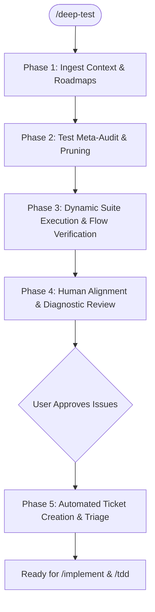

# Deep Test

An advanced, multi-phase testing and verification skill that first **meta-audits existing tests** for quality, pruning shallow and redundant tests, **executes full-stack tests and dynamic user flows**, and seamlessly **bridges failures and high-risk test gaps into actionable GitHub issues**.

---

## Core Principles

1. **Test Quality Over Vanity Counts**: A suite of 100 shallow tests that only check `status_code == 200` without verifying state mutations or data integrity creates a false sense of security.
2. **Public Seam Focus (`/tdd`)**: Tests must target public domain boundaries and vertical slices rather than private internals, ensuring they remain resilient during internal refactoring.
3. **Mock Realism**: Mocks must accurately reflect current schemas (Supabase, Garmin, Strava, OpenAI tool responses) and test failure paths (429 rate limits, timeouts, bad payloads).
4. **Human Alignment Before Issue Filing**: Present test diagnostics, failure traces, and identified test gaps to the human before creating issues.
5. **Direct Bridge to `/implement` and `/tdd`**: Create precise `ready-for-agent` issues with reproduction code and clear acceptance criteria.

---

## Execution Workflow



---

### Phase 1: Ingest Context & Active Roadmaps

1. **Review Domain Model**: Read `CONTEXT.md` to identify core entities (*Athlete Profile*, *Goal Set*, *Telemetry Sample*, *Biomarker Panel*, *Calendar Session*, *Fast Context*, *Interactive Chat Widgets*).
2. **Review Active Issues & Roadmaps**:
   - Run `gh issue list --state open` to see which features are actively undergoing refactoring or development.
   - Respect settled ADRs in `docs/adr/`.

---

### Phase 2: Test Meta-Audit & Pruning

Inspect existing tests across `tests/unit/`, `tests/integration/`, `tests/e2e/`, and frontend test configurations.

#### Quality Inspection Checklist:
1. **Assertion Rigor**:
   - Flag tests that assert only HTTP status codes without validating payload contents, database state, or side effects.
   - Detect "tautological mocks" (tests that assert a mock returns what the mock was configured to return).
2. **Mock Realism & Drift**:
   - Check if `mock_supabase.py` and service mocks match actual production table structures and constraints.
   - Verify negative and error paths are tested (e.g., Supabase network failure, malformed biomarker OCR text, unauthenticated requests).
3. **Redundancy & Pruning**:
   - Identify redundant or duplicate unit tests that test identical internal methods.
   - Consolidate low-hanging fruit into cleaner parameter-driven fixtures.
4. **Blind Spot Detection**:
   - **Auth & Isolation**: Verify tests exist ensuring Athlete A cannot access Athlete B's journals or telemetry.
   - **Agent Engine & Widgets**: Check that interactive chat widget schemas (`plan approval modal`, `macro calculator`) and tool invocations have strict schema validation tests.
   - **Fast Context**: Check that rolling context snapshot assembly is verified for deterministic output.

---

### Phase 3: Dynamic Suite Execution & Flow Verification

Run the test suite across both backend and frontend layers:

#### 1. Backend Test Runner (pytest)
```bash
pytest tests/ -v --durations=10
```
- Capture test passes, failures, skips, and slow tests (>500ms).

#### 2. Frontend Checks (`gymbro-frontend-expo`)
```bash
cd gymbro-frontend-expo && npx tsc --noEmit
```
- Verify TypeScript types, router navigation contracts, and missing props.

#### 3. Core Tracer Bullet Flow Verification
Verify end-to-end integration across key pipelines:
- **Telemetry Flow**: Ingestion -> Health Lake deduplication -> Fast Context snapshot.
- **Biomarker Flow**: Upload -> Parsing -> Abnormal flag calculation -> Coaching advisory.
- **Widget Flow**: Chat turn -> Agent Tool invocation -> Structured JSON Widget response -> Client action response.

---

### Phase 4: Human Alignment & Diagnostic Review (HITL)

Present a structured **Test Health & Execution Report** to the user:

```markdown
# GYMBro Deep Test & Quality Report

## 1. Test Suite Quality Scorecard
| Dimension | Rating | Assessment |
| :--- | :--- | :--- |
| **Assertion Depth** | 🟢/🟡/🔴 | ... |
| **Mock Realism** | 🟢/🟡/🔴 | ... |
| **Edge Case / Error Paths** | 🟢/🟡/🔴 | ... |
| **Public Seam Focus** | 🟢/🟡/🔴 | ... |

### ⚠️ Quality Observations & Pruning Recommendations
- **Prune / Simplify**: `tests/...` is redundant with `tests/...`.
- **Shallow Assertions**: `test_nutrition_routes.py` needs state verification on saved macros.
- **Missing Critical Seams**: No test verifying token expiration behavior on `/api/agent/chat`.

---

## 2. Dynamic Execution Matrix
- **Backend Tests**: X Passed, Y Failed, Z Skipped
- **Frontend Typecheck**: Clean (or list of errors)
- **Flow Assertions**: Telemetry (Pass), Biomarkers (Pass), Widgets (Pass/Fail)

---

## 3. Failure Tracebacks (if any)
```python
# Exact traceback snippet with file link and error details
```

---

## Alignment Questions for the Human
1. Would you like to file issues for the failing tests and identified quality gaps?
2. Should we immediately proceed to fix high-priority failures via `/implement`?
```

**Pause and wait for human confirmation.**

---

### Phase 5: Automated Ticket Creation & Triage

For all confirmed bugs, failing tests, or critical missing test seams:

1. **Publish to Issue Tracker**:
   - Use `gh issue create` per `docs/agents/issue-tracker.md`:
     ```bash
     gh issue create \
       --title "Fix: <Failure Description or Test Gap>" \
       --body "## Failing Test / Missing Seam\n\`\`\`\n<Traceback or Seam Description>\n\`\`\`\n\n## Affected Files\n- [<file>](file://<path>)\n\n## Acceptance Criteria\n- [ ] Fix root cause\n- [ ] Add regression test asserting real state\n- [ ] Passing pytest\n" \
       --label "ready-for-agent"
     ```
2. **Hand-Off**:
   - Present the created issue numbers.
   - Offer to claim and resolve the first unblocked issue using `/implement` and `/tdd`.
