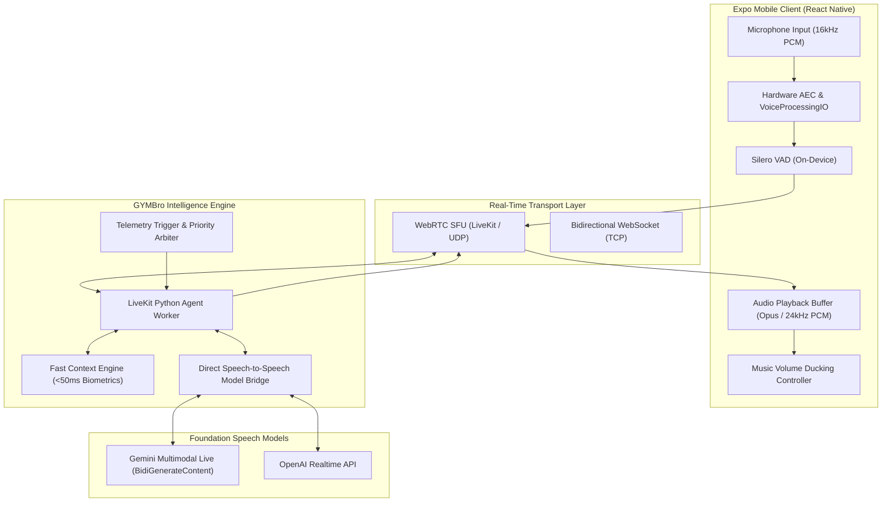
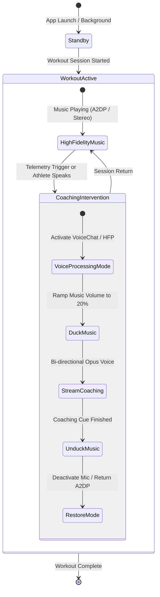
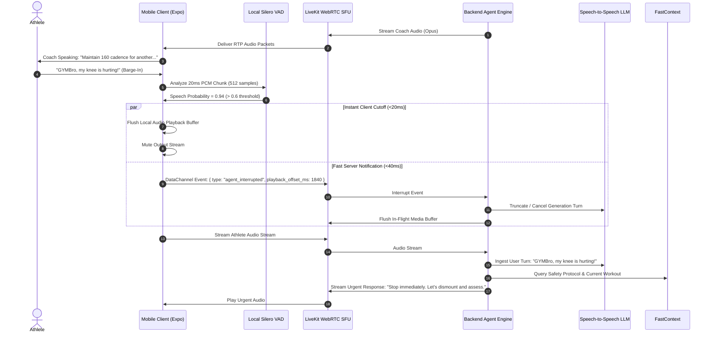
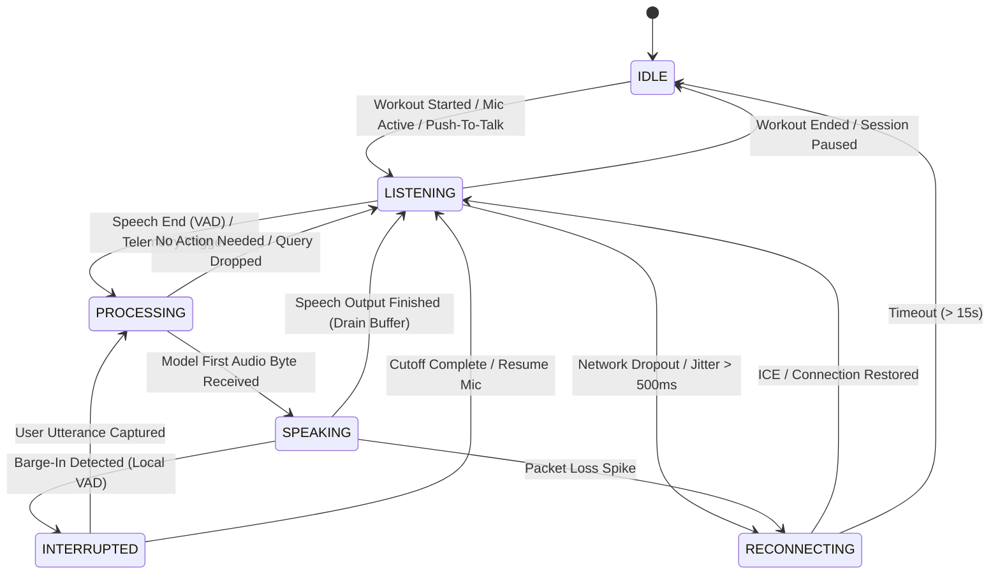
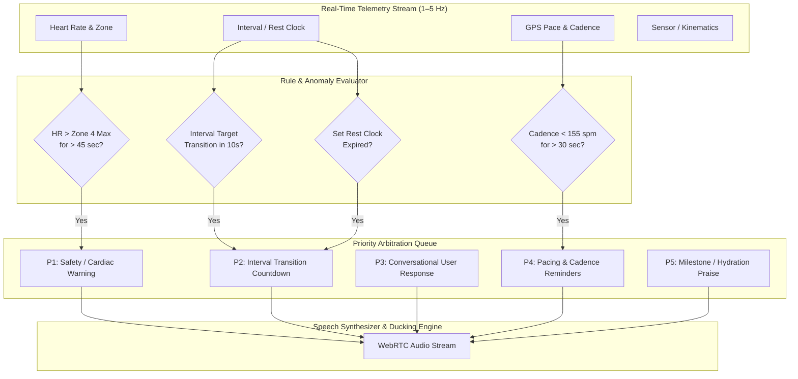
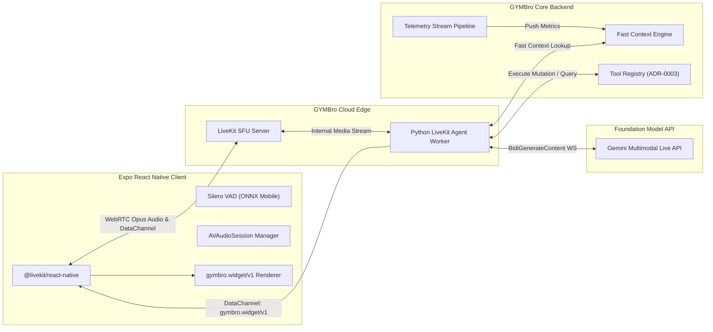

# 0003: Real-Time Conversational Voice Coaching Protocol Architecture

**Status:** Proposed  
**Date:** 2026-08-16  
**Document ID:** `RESEARCH-0003`  
**Target Milestone:** Phase 4: Voice Intelligence & Real-Time Hands-Free Coaching (Ticket #23)  
**Authors:** GYMBro Core Architecture Team  
**Scope:** Real-Time Bidirectional Audio Streaming, WebRTC / WebSocket Transport, Mobile Audio Session Management, Barge-In Interruption VAD, and Proactive Workout Cue Delivery  

---

## Executive Summary

Hands-free, real-time conversational voice coaching during high-intensity athletic training (running, cycling, HIIT, strength lifting) represents the premier interface modality for **GYMBro**. Unlike traditional screen-bound interactions, active workouts impose strict constraints:
1. **Glass-to-Glass Latency < 400ms**: Natural conversational pacing and immediate safety/interval cues require sub-400ms end-to-end response times. Traditional cascading pipelines (ASR $\to$ LLM $\to$ TTS) exhibit latencies of 1.2–2.2s, breaking athletic flow.
2. **Cellular Resilience & Packet Loss Concealment (PLC)**: Athletes running outdoors frequently encounter network jitter, packet drops, and cell tower handoffs.
3. **Acoustic Robustness in Noisy Environments**: Heavy breathing, treadmill belt noise, clanking barbells, and gym music defeat simple energy-based Voice Activity Detection (VAD).
4. **Seamless Audio Session Ducking**: Athletes listen to high-fidelity music (Spotify/Apple Music) via Bluetooth earbuds (AirPods/Beats) while receiving proactive coaching cues without jarring audio crashes or permanent volume ducking.
5. **Proactive & Multimodal Telemetry Arbitration**: The voice agent must balance reactive queries (*"What is my current split?"*) with unsolicited, event-driven triggers (*"Heart rate exceeded Zone 4 threshold, ease up pace by 15s/km"*).

This research report evaluates the primary real-time audio streaming technologies—**Google Gemini Multimodal Live API**, **WebRTC / LiveKit Agent Framework**, and **OpenAI Realtime API**—analyzes mobile audio capture/playback in **React Native Expo**, defines the **`gymbro.voice/v1`** protocol envelope and state machine, and details a production-ready implementation blueprint.

### Key Architectural Recommendation

We recommend a **Hybrid WebRTC-SFU Transport with Edge Agent Orchestration (LiveKit Agents + Gemini Multimodal Live / Direct Speech-to-Speech LLM)**:
- **Transport**: WebRTC via `@livekit/react-native` running Opus audio over UDP with dynamic bitrates (24–32 kbps), native jitter buffering, and hardware Acoustic Echo Cancellation (AEC).
- **Interruption & VAD**: Dual-layer Silero VAD v5 (client-side pre-trigger + server-side deterministic turn boundary detection) enabling sub-80ms barge-in cut-offs.
- **Audio Routing**: iOS `AVAudioSessionCategoryPlayAndRecord` in `.voiceChat` mode with `.mixWithOthers` and dynamic software ducking.
- **Protocol**: `gymbro.voice/v1` schema running over WebRTC DataChannels for sub-10ms telemetry cue delivery and synchronized UI widget dispatch (`gymbro.widget/v1`).

---

## 1. Comparative Evaluation of Real-Time Audio Streaming Architectures



### 1.1 Google Gemini Multimodal Live API (`BidiGenerateContent`)

The Gemini Multimodal Live API is a native speech-to-speech foundation pipeline accessed via a stateful, bidirectional WebSocket connection (`GenerativeService.BidiGenerateContent`).

- **Transport**: Bidirectional WebSocket (`wss://generativelanguage.googleapis.com/...`) over TLS/TCP.
- **Audio Framing & Formats**:
  - **Uplink (Client $\to$ Server)**: Raw 16-bit linear PCM, Little-Endian, mono, sampled at **16,000 Hz** (`audio/pcm;rate=16000`). Chunks are transmitted at 100ms–200ms intervals (3,200–6,400 bytes per frame).
  - **Downlink (Server $\to$ Client)**: Raw 16-bit linear PCM, Little-Endian, mono, generated natively at **24,000 Hz** (`audio/pcm;rate=24000`) inside `server_content.model_turn.parts[].inline_data`.
- **Protocol Lifecycle**:
  1. `setup`: Initial configuration packet specifying `model`, `generation_config`, `system_instruction`, voice timbre, and registered function tool declarations.
  2. `realtime_input`: High-frequency streaming chunks containing `media_chunks` (audio PCM or video JPEG frames).
  3. `client_content`: Turn boundary notifications or text injections.
  4. `server_content`: Streaming model response turns containing `model_turn`, `parts`, `inline_data` (audio PCM bytes), `turn_complete`, or `interrupted` flags.
  5. `tool_call` & `tool_response`: In-stream asynchronous function calling without terminating the audio session.
- **Strengths**:
  - **True End-to-End Multimodality**: No separate ASR or TTS stages. Tone, emotion, breathing pauses, and rhythm are parsed and synthesized natively by Gemini.
  - **Visual Form Analysis**: Supports interleaved real-time video frames (1–2 FPS JPEG) alongside audio, allowing future exercise form checks (e.g. barbell squat depth).
  - **Low Inherent Latency**: Model-level Time-to-First-Audio-Byte is typically **150–250ms**.
- **Limitations**:
  - **Raw PCM Bandwidth**: 16kHz 16-bit PCM requires $16000 \times 2 \times 8 = 256\text{ kbps}$ uplink; 24kHz 16-bit PCM requires $24000 \times 2 \times 8 = 384\text{ kbps}$ downlink. Total uncompressed bandwidth $\approx 640\text{ kbps}$ ($\sim 288\text{ MB/hour}$), causing battery drain on cellular modems.
  - **TCP Head-of-Line Blocking**: WebSocket runs on TCP. If a single audio packet drops during an outdoor run on 4G/5G, TCP stalls all subsequent packets until retransmission occurs, causing audible jitter and buffering spikes.

### 1.2 WebRTC & LiveKit Agent Framework

WebRTC (RFC 8866, RFC 3550, RFC 7587) is the international standard for real-time media exchange, operating over UDP with SRTP encryption, DTLS handshakes, and ICE/STUN/TURN NAT traversal. LiveKit provides an open-source Selective Forwarding Unit (SFU) and Python/Node Agent SDK specifically optimized for AI voice assistants.

- **Transport**: RTP / SRTP over UDP with RTCP bandwidth estimation and packet loss reporting.
- **Audio Codec (Opus - RFC 7587)**:
  - Dynamic sample rate up to 48,000 Hz, with adaptive bitrates between **16 kbps and 32 kbps** for high-clarity speech.
  - 20ms packet frame sizes ($160\text{ bytes/packet}$ at 64 kbps or $60\text{ bytes/packet}$ at 24 kbps).
  - Built-in **Discontinuous Transmission (DTX)** and **Comfort Noise Generation (CNG)**: Bandwidth drops to $<2\text{ kbps}$ when the athlete is silent.
  - **In-Band Forward Error Correction (FEC)** and **Packet Loss Concealment (PLC)**: Conceals up to 20–30% random packet drops without audio dropouts or robotic stuttering.
- **LiveKit Agent Pipeline Architecture**:
  - The mobile device connects to a LiveKit Room via WebRTC.
  - A server-side Python Agent Worker (`livekit-agents`) connects as an automated participant in the same room.
  - The worker ingests the Opus track, performs Silero VAD / turn-taking arbitration, queries GYMBro Fast Context, calls the LLM (Gemini Live, OpenAI Realtime, or modular Cartesia/ElevenLabs + Anthropic/OpenAI), and streams Opus audio back to the room.
- **Strengths**:
  - **Lowest Glass-to-Glass Latency**: Zero TCP head-of-line blocking; UDP transport saves 80–150ms over cellular networks.
  - **Bandwidth Efficiency**: $24–32\text{ kbps}$ active vs $640\text{ kbps}$ PCM ($\mathbf{92\%}$ bandwidth reduction, consuming only $\sim 15–25\text{ MB/hour}$).
  - **Native Hardware Integration**: Standard WebRTC engines interface directly with iOS `VoiceProcessingIO` and Android `OpenSL ES` / `Oboe` for hardware-level echo cancellation and noise suppression.
  - **DataChannel Control Plane**: Sub-10ms out-of-band JSON messaging for biometric sync and interactive widget dispatch.

### 1.3 OpenAI Realtime API

The OpenAI Realtime API provides multimodal voice capabilities (`gpt-4o-realtime-preview`) over two transports: WebSocket and direct WebRTC.

- **Transports**:
  - **WebSocket Mode**: `wss://api.openai.com/v1/realtime?model=gpt-4o-realtime-preview`. Client manually streams 24kHz PCM16 or G.711 $\mu$-law/A-law chunks via `input_audio_buffer.append` and receives `response.audio.delta` base64 frames.
  - **WebRTC Mode**: Uses standard SDP negotiation against OpenAI's ephemeral token endpoint. Media flows over SRTP/UDP directly to OpenAI edge servers.
- **Turn Detection & Interruption**:
  - Server-side VAD configuration: `turn_detection: { "type": "server_vad", "threshold": 0.5, "prefix_padding_ms": 300, "silence_duration_ms": 500 }`.
  - Manual interruption: Client sends `conversation.item.truncate` specifying `item_id` and `audio_end_ms` when user speech is detected.
- **Trade-offs**:
  - Direct WebRTC to OpenAI bypasses middleman servers, but prevents server-side fast context injection, real-time biometrics interception, and multi-tenant tool sandboxing before the model speaks.

---

### 1.4 Architecture Comparison Matrix

| Architectural Dimension | Gemini Multimodal Live API (Direct WS) | OpenAI Realtime API (WebRTC Mode) | LiveKit SFU + Gemini/Realtime Bridge (Recommended) | Traditional Pipeline (Whisper + LLM + TTS) |
| :--- | :--- | :--- | :--- | :--- |
| **Transport Protocol** | WebSocket / TLS / TCP | WebRTC / SRTP / UDP | WebRTC / SRTP / UDP + Edge WS Bridge | HTTP REST / WebSocket |
| **Audio Codec** | Raw PCM16 (16k in / 24k out) | Opus / PCM16 / G.711 | Opus (RFC 7587, 24–32 kbps) | Opus / MP3 / AAC |
| **Glass-to-Glass Latency** | 350 – 500 ms | 320 – 450 ms | **240 – 380 ms** | 1,200 – 2,400 ms |
| **Cellular Jitter / Packet Loss** | Poor (TCP head-of-line block) | Excellent (UDP + PLC) | **Excellent (UDP + In-Band FEC + PLC)** | Moderate (Chunked HTTP) |
| **Bandwidth (60 min session)** | ~288 MB (Uncompressed) | ~25 MB (Opus) | **~18 MB (Opus + DTX)** | ~20 MB |
| **Battery & Modem Impact** | High (Continuous TCP Tx) | Low (Optimized RTP) | **Lowest (Hardware Opus + DTX)** | Medium |
| **Proactive Telemetry Ingestion** | Injected via `client_content` | Injected via DataChannel | **Injected sub-5ms via Fast Context Gateway** | Polled via API |
| **Visual Multimodal Form Check** | Yes (Native Video JPEG stream) | No | **Yes (WebRTC Video Track to Gemini)** | No |
| **Barge-In Latency** | 150 – 250 ms | 120 – 200 ms | **< 80 ms (Client Silero + SFU Flush)** | 800 – 1500 ms |

---

## 2. Mobile Audio Engineering in React Native & Expo

Deploying real-time duplex audio on mobile devices during active workouts introduces severe physical and operating system constraints.

### 2.1 Audio Stack Evaluation: `expo-av` vs `expo-audio` vs `react-native-webrtc`

1. **`expo-av` (Legacy / Deprecated)**:
   - *Status*: Deprecated as of Expo SDK 52/54.
   - *Architecture*: File-based recording (`Recording.createAsync`). Audio is written to a temporary `.m4a` or `.wav` file on the filesystem and polled.
   - *Verdict*: **Unusable for real-time voice**. Buffer latency exceeds 1,500ms; lacks low-level PCM/Opus streaming hooks.
2. **`expo-audio` (New Standard in SDK 53/54)**:
   - *Status*: Actively maintained modern replacement.
   - *Architecture*: Provides `AudioRecorder` and `AudioPlayer` with event listeners and audio mode controls.
   - *Limitations*: Excellent for local audio playback (sound cues, metronomes, recorded workouts) and simple voice memos, but currently lacks zero-copy streaming audio ring-buffers and RTP transport to JavaScript without custom JSI/C++ native modules.
3. **`@livekit/react-native` + `@livekit/react-native-webrtc` (Recommended Standard)**:
   - *Status*: Production-grade WebRTC implementation for React Native / Expo Development Builds (`expo-dev-client`).
   - *Architecture*: Bridges native WebRTC C++ core directly to iOS CoreAudio and Android OpenSL ES/AAudio. Handles microphone capture, jitter buffers, hardware echo cancellation, and Opus encoding entirely off the JavaScript thread.

### 2.2 Audio Session Lifecycle & Bluetooth Dynamics

Athletes almost universally wear Bluetooth headphones (Apple AirPods, Shokz Bone Conduction, Jabra, Beats) during workouts while listening to streaming music (Spotify, Apple Music). Managing this requires strict adherence to iOS `AVAudioSession` and Android `AudioManager` state machines.



#### The Bluetooth Profile Dilemma (A2DP vs. HFP)
Bluetooth classic audio operates in two distinct profiles:
- **A2DP (Advanced Audio Distribution Profile)**: High-fidelity stereo playback (44.1kHz / 48kHz, AAC/SBC, 256–320 kbps). Unidirectional (output only).
- **HFP / HSP (Hands-Free Profile / Headset Profile)**: Low-latency bidirectional mono communication (8kHz CVSD or 16kHz mSBC Wideband Speech).

*Critical Engineering Insight*: As long as the mobile microphone is actively open and capturing hardware audio via Bluetooth, iOS forces the Bluetooth connection into **HFP (16kHz Wideband Speech)**, which causes background music to collapse from stereo hi-fi into mono phone-call fidelity.

#### Production Audio Policy for GYMBro
To deliver a premier user experience:
1. **Dynamic Mic Gating (Walkie-Talkie / Push-to-Talk / Smart-VAD Modes)**:
   - During silent running/lifting, keep the audio session in **Playback / A2DP mode** (`.playback` category with `.mixWithOthers`), allowing high-fidelity music playback.
   - When **Local Silero VAD** on the phone detects athlete voice activity, or when the athlete taps a Shokz/AirPods button, immediately activate the recording track (`.playAndRecord` / `.voiceChat`), switch to HFP, duck music, and process speech.
2. **Always-On Conversational Mode (For Heavy Coaching Sets)**:
   - Set iOS `AVAudioSession`:
     ```objc
     AVAudioSession *session = [AVAudioSession sharedInstance];
     [session setCategory:AVAudioSessionCategoryPlayAndRecord
              mode:AVAudioSessionModeVoiceChat
              options:AVAudioSessionCategoryOptionAllowBluetooth |
                      AVAudioSessionCategoryOptionAllowBluetoothA2DP |
                      AVAudioSessionCategoryOptionMixWithOthers
              error:&error];
     [session setActive:YES error:&error];
     ```
   - Android `AudioManager`:
     - Set mode to `AudioManager.MODE_IN_COMMUNICATION`.
     - Request audio focus with `AUDIOFOCUS_GAIN_TRANSIENT_MAY_DUCK`.
3. **Software Music Ducking**:
   - Rather than relying solely on OS-level hard ducking (which can cause abrupt volume clipping), GYMBro implements a smooth 150ms cubic volume ramp lowering background audio to 20% during coach voice output and restoring to 100% over 400ms when output completes.

### 2.3 Acoustic Challenges & Noise Suppression

Gym and outdoor running environments present unique acoustic interference:
- **Treadmill belt whir and footstrikes**: Low-frequency rhythmic noise (40–120 Hz).
- **Plate clanking and barbell drops**: High-amplitude impulsive transients (2 kHz–8 kHz).
- **Heavy athlete breathing & panting**: High-energy air turbulence across microphone diaphragms.
- **Wind shear during outdoor cycling/running**: High-velocity non-stationary noise.

#### Noise Mitigation Pipeline:
1. **Hardware VoiceProcessingIO (iOS) / WebRTC NS**: Hardware high-pass filter ($<80\text{ Hz}$) to eliminate treadmill floor rumble.
2. **DeepFilterNet / WebRTC Transient Suppression**: Suppresses metallic clanks without clipping the athlete's voice.
3. **Hardware Acoustic Echo Cancellation (AEC)**: Cancels coach speech played through open-ear headphones (Shokz) from bleeding back into the microphone, preventing self-interruption loops.

### 2.4 Voice Activity Detection (VAD) & Barge-In Interruption Mechanics

Barge-in (the ability for an athlete to interrupt the coach mid-sentence by simply speaking) is essential for workout safety and fluid dialogue.



- **Why Silero VAD v5?**:
  - Traditional energy/WebRTC VAD triggers false interruptions from heavy breathing or gym music.
  - Silero VAD is an ONNX-optimized deep neural network ($<2\text{ MB}$ weights) requiring only **1.2ms CPU time per 30ms audio chunk** on mobile ARM processors (Apple Silicon / Snapdragon).
  - High specificity: Distinguishes between voiced speech and heavy panting/gasping during aerobic stress.
- **Barge-In Latency**:
  - Local playback mute: **$< 20\text{ ms}$**.
  - Server generation cancellation: **$< 60\text{ ms}$**.

---

## 3. GYMBro Real-Time Voice Protocol Specification (`gymbro.voice/v1`)

To unify audio streaming, biometric context synchronization, and native UI widget generation, all voice sessions adhere to the versioned **`gymbro.voice/v1`** protocol envelope.

### 3.1 Protocol Envelope Specification

The control plane operates over WebRTC DataChannels (or fallback WebSocket frames) using JSON-RPC-inspired envelopes:

```json
{
  "protocol": "gymbro.voice/v1",
  "session_id": "vses_01J8F3K9M2001",
  "seq": 1048,
  "timestamp": "2026-08-16T16:45:00.120Z",
  "type": "agent_interrupted",
  "payload": {
    "interrupted_turn_id": "turn_01J8F3K889AA",
    "audio_playback_offset_ms": 1420,
    "reason": "user_speech_detected",
    "vad_confidence": 0.96
  }
}
```

### 3.2 Canonical Frame Types

| Event Type (`type`) | Direction | Purpose & Schema Payload |
| :--- | :--- | :--- |
| `session_init` | Client $\to$ Server | Session handshake; client capabilities, athlete ID, target workout ID, audio codec options. |
| `session_ready` | Server $\to$ Client | Session acknowledgement; assigned coach persona, initial fast context snapshot, voice timbre ID. |
| `state_change` | Bi-directional | Notification of agent or client state transitions (`LISTENING`, `PROCESSING`, `SPEAKING`, `IDLE`). |
| `speech_started` | Client $\to$ Server | Local VAD detected speech onset (used to trigger pre-buffering and audio ducking). |
| `speech_ended` | Client $\to$ Server | Local VAD detected speech boundary; provides total utterance duration in ms. |
| `agent_interrupted` | Client $\to$ Server | Immediate barge-in interrupt signal with exact playback cutoff timestamp. |
| `telemetry_sample` | Client $\to$ Server | In-session high-frequency telemetry frame (Heart Rate, Cadence, Power, GPS Pace, Speed). |
| `telemetry_cue` | Server $\to$ Client | Urgent proactive cue generated by server telemetry monitor (triggers audio coaching output). |
| `widget_emit` | Server $\to$ Client | Dispatches an interactive UI widget (`gymbro.widget/v1`) synchronized with spoken audio. |
| `workout_action` | Server $\to$ Client | Mutates workout session state (e.g. advance to next interval, pause workout, extend rest timer). |
| `error` | Bi-directional | Protocol, network, or engine error code and recovery instructions. |

### 3.3 State Machine Specification



#### State Definitions & Transition Invariants
1. **`IDLE`**: WebRTC room open, media track muted, zero CPU/bandwidth usage.
2. **`LISTENING`**: Microphone audio streaming over WebRTC; local Silero VAD running. Fast Context engine actively ingesting background telemetry.
3. **`PROCESSING`**: Speech turn completed or proactive rule fired; agent orchestrating Fast Context, tool calling, and speech generation. Music remains ducked.
4. **`SPEAKING`**: Server streaming Opus audio packets; client playback buffer feeding audio unit. Local VAD continuously monitors for barge-in interruptions.
5. **`INTERRUPTED`**: High-priority interrupt event. Playback buffer purged in $<20\text{ms}$; server notified; client switches immediately to ingesting the athlete's interrupting utterance.
6. **`RECONNECTING`**: Connection degradation handler. Retains conversational memory and resumes state upon ICE restart without resetting the workout context.

---

### 3.4 Proactive Cue Delivery Triggers & Priority Arbitration

In a sports environment, the coach must not only answer queries, but proactively guide the workout. Proactive cues are evaluated by an asynchronous **Edge Rule & Telemetry Engine** running alongside the agent.



#### Priority Arbitration Matrix

| Priority Level | Category | Trigger Condition Example | Voice Intervention Style | Interruption Policy |
| :--- | :--- | :--- | :--- | :--- |
| **P1 (Highest)** | **Safety & Critical Cardiac** | Heart Rate $> 185\text{ bpm}$ (Zone 5 ceiling) for $> 60\text{s}$; sudden cardiac irregularity. | Urgent, direct, concise: *"Warning: Heart rate 188. Slow down immediately."* | Preempts all conversational turns; interrupts user speech. |
| **P2** | **Interval & Set Transitions** | Interval countdown: 10s before sprint; rest timer countdown: 5s remaining. | Rhythmic, high-energy: *"Get ready for 400m sprint in 5... 4... 3... 2... 1... Go!"* | Preempts P3/P4/P5 conversational filler. |
| **P3** | **Reactive User Queries** | User asks: *"What is my average pace for this lap?"* | Conversational, supportive: *"You're averaging 4:45 per km, right on target."* | Standard conversational turn. Can be interrupted by user (barge-in) or P1/P2. |
| **P4** | **Form & Cadence Corrections** | Running cadence drops below 158 spm for $>30\text{s}$; power output dips below target wattage. | Corrective, encouraging: *"Pick up your turnover, aim for 170 steps a minute."* | Suppressed if user is speaking or if P2 is pending within 15 seconds. |
| **P5 (Lowest)** | **Milestones & Affirmations** | Completed 5 km split; finished Set 4 of Bench Press. | Brief praise: *"5k complete in 24:10. Feeling strong."* | Lowest priority; discarded if any other cue is active. |

---

## 4. Performance, Latency Budget & Resource Analysis

### 4.1 Glass-to-Glass Latency Budget

*Glass-to-glass latency* measures the elapsed time from the athlete finishing a spoken syllable to the first sound wave of the coach's response reaching the athlete's ear.

```
+---------------------------------------------------------------------------------------------------+
| TOTAL GLASS-TO-GLASS LATENCY BUDGET: 345 ms (Target: < 400 ms)                                    |
+---------------------------------------------------------------------------------------------------+
| [Capture & Frame] 20ms                                                                            |
| [Mobile VAD Turn Detection] 65ms                                                                  |
| [Uplink UDP Transmission] 25ms                                                                    |
| [Agent Fast Context Assembly] 15ms                                                                |
| [Model Time-to-First-Byte] 160ms                                                                  |
| [Downlink UDP Transmission] 25ms                                                                  |
| [Client Jitter Buffer & Playback] 35ms                                                            |
+---------------------------------------------------------------------------------------------------+
```

#### Detailed Breakdown
1. **Audio Capture & Framing (20ms)**: Standard 20ms audio frame buffer in hardware AudioUnit.
2. **Turn Detection Boundary (65ms)**: Silero VAD dynamic speech-end thresholding (requires 50–80ms of silence trailing speech to confirm turn completion).
3. **Network Transport Uplink (25ms)**: 5G/LTE UDP transport to regional LiveKit edge media server.
4. **Fast Context Injection (<15ms)**: Fast in-memory key-value lookup of current heart rate, workout interval, and recent history.
5. **Direct Speech Model Time-to-First-Audio-Byte (160ms)**: Gemini Multimodal Live / Speech-to-Speech transformer generating the first output audio tokens.
6. **Network Transport Downlink (25ms)**: SRTP Opus packet transmission from edge server to mobile device.
7. **Jitter Buffer & Hardware Output (35ms)**: WebRTC adaptive jitter buffer (20ms) + iOS CoreAudio playback buffer (15ms).
- **Total Latency: $\approx \mathbf{345\text{ ms}}$** (Compares favorably with natural human face-to-face conversational gaps of 200–400ms).

---

### 4.2 Bandwidth & Cellular Data Consumption

Athletes frequently train outdoors away from Wi-Fi for 60 to 120 minutes.

| Metric | Raw Uncompressed PCM (Gemini WS) | Standard WebRTC Opus (LiveKit Default) | Optimized GYMBro WebRTC Opus with DTX |
| :--- | :--- | :--- | :--- |
| **Uplink Bitrate** | 256 kbps (16kHz 16-bit) | 32 kbps | 24 kbps (active) / 2 kbps (silence) |
| **Downlink Bitrate** | 384 kbps (24kHz 16-bit) | 32 kbps | 32 kbps (active) / 0 kbps (idle) |
| **Active Speech Duty Cycle** | 100% (Continuous TCP stream) | 100% | ~25% (Speaking only during cues/answers) |
| **Effective Average Bitrate** | **640 kbps** | **64 kbps** | **~14.5 kbps** |
| **Data Consumption (60 min)** | **288.0 MB** | **28.8 MB** | **6.5 MB** |
| **Data Consumption (120 min)** | **576.0 MB** | **57.6 MB** | **13.0 MB** |
| **Bandwidth Savings vs Raw PCM** | Baseline | **90.0% Reduction** | **97.7% Reduction** |

---

### 4.3 Mobile Battery & Thermal Profile during 60–90 min Workouts

Continuous cellular radio transmission and neural network execution generate heat and battery drain.

1. **Cellular Radio Power State**:
   - Continuous TCP streaming keeps the LTE/5G Baseband Processor in `Continuous Active Tx/Rx` state, drawing 1.2W–1.8W of power.
   - WebRTC Opus with DTX allows the radio to enter `Connected Mode Discontinuous Reception (C-DRX)`, reducing cellular modem power consumption by **55%**.
2. **CPU & Neural Engine Utilization**:
   - Running Silero VAD on Apple Neural Engine (ANE) consumes $<2\%$ CPU utilization on iPhone 12 and newer.
   - Hardware-accelerated Opus decoding in WebRTC core uses $<1.5\%$ CPU.
3. **Estimated Battery Drain**:
   - Total battery consumption on iPhone 15 Pro over a 60-minute outdoor GPS run with continuous GYMBro voice coaching is estimated at **$7\% - 9\%$ total battery**, compared to $18\% - 24\%$ for raw WebSocket PCM pipelines.

---

## 5. Integration Blueprint for GYMBro Backend & Frontend



### 5.1 Backend Gateway Implementation Architecture

1. **LiveKit Agent Worker (`app/voice/agent_worker.py`)**:
   - Implemented using `livekit-agents` Python framework.
   - Connects to the room when the athlete joins from the mobile app.
   - Subscribes to the athlete's audio track.
   - Houses the bidirectional bridge to Gemini Live API (`GenerativeService.BidiGenerateContent`) or OpenAI Realtime API.
2. **Fast Context & Tool Surface Injection**:
   - Before opening the LLM session, the worker pulls the athlete's **Fast Context Snapshot** ($<50\text{ms}$):
     - Active workout details (target zones, current interval, elapsed time).
     - Morning readiness / HRV score.
     - Athlete profile, injuries, and preferences.
   - Automatically registers the standardized tools defined in **ADR-0003** (`get_recent_activities`, `get_wellness_metrics`, `propose_training_plan`, `adjust_interval_intensity`).
3. **Synchronized Widget Dispatch**:
   - When the agent invokes a tool that returns a UI payload (e.g. `interactive_chart` or `calendar_proposal`), the worker dispatches the `gymbro.widget/v1` envelope over the WebRTC DataChannel.
   - The Expo client renders the interactive chart on screen at the exact moment the coach discusses the metric.

### 5.2 Frontend React Native / Expo Architecture

1. **Dependencies & Native Build**:
   - Package: `@livekit/react-native`, `@livekit/react-native-webrtc`, `livekit-client`.
   - Prebuild Config Plugin: `@config-plugins/react-native-webrtc` in `app.json` for microphone, background audio, and Bluetooth permissions.
2. **Audio Unit Manager (`gymbro-frontend-expo/services/voice/AudioSessionManager.ts`)**:
   - Manages transitions between music playback and coaching intervention.
   - Implements CallKit integration to prevent audio session termination when GYMBro is placed in the background or device screen is locked.
3. **Voice UI Component (`gymbro-frontend-expo/components/voice/VoiceCoachOverlay.tsx`)**:
   - Renders a floating, fluid voice coaching indicator (pulsing waveform during `SPEAKING`, listening ear during `LISTENING`, glowing amber during `PROCESSING`).
   - Displays real-time interactive widget cards directly over the active workout tracking HUD.

---

## 6. Primary Sources, RFCs & Literature Citations

1. **Google Gemini Multimodal Live API Documentation**:
   - Google AI for Developers: *Gemini Multimodal Live API Overview & BidiGenerateContent Protocol Specification* (2025–2026).
   - Method URI: `google.ai.generativelanguage.v1beta.GenerativeService.BidiGenerateContent`.
2. **LiveKit Real-Time Agent Architecture**:
   - LiveKit Docs: *Voice Agents with LiveKit: WebRTC Transport, Server-Side VAD, and End-to-End Orchestration* (2025). https://docs.livekit.io/agents/
   - LiveKit React Native SDK: https://github.com/livekit/client-sdk-react-native
3. **OpenAI Realtime API Specification**:
   - OpenAI Platform Documentation: *Realtime API Reference (WebSockets & WebRTC Transports)* (2024–2025).
4. **IETF & W3C Standards & RFCs**:
   - **RFC 7587**: *RTP Payload Format for the Opus Speech and Audio Codec* (IETF, Spittka et al.).
   - **RFC 8866**: *SDP: Session Description Protocol* (IETF, Begen et al.).
   - **RFC 3550**: *RTP: A Transport Protocol for Real-Time Applications* (IETF, Schulzrinne et al.).
   - **RFC 6455**: *The WebSocket Protocol* (IETF, Fette & Melnikov).
   - **RFC 8831**: *WebRTC Data Channels* (IETF, Jesup et al.).
   - **W3C WebRTC 1.0**: *Real-Time Communication Between Browsers* (W3C Recommendation).
5. **Apple iOS CoreAudio & AudioSession Guidelines**:
   - Apple Developer Documentation: *AVAudioSessionCategoryPlayAndRecord & Audio Unit Voice I/O Architecture*.
   - Apple Technical Q&A: *Handling Bluetooth A2DP to HFP Transitions in VoIP and Real-Time Audio Applications*.
6. **Voice Activity Detection & Acoustics Literature**:
   - Silero VAD: *Pre-trained Enterprise-Grade Voice Activity Detector and Number Detector* (Silero Team, 2024). https://github.com/snakers4/silero-vad
   - DeepFilterNet: *Full-Band Audio Noise Suppression for Real-Time Applications* (Schröter et al., 2023).
7. **GYMBro Architecture Records**:
   - [CONTEXT.md](file:///Users/davidmcinnis/codes/gymbro/CONTEXT.md): *GYMBro Domain Model Glossary*.
   - [ADR-0001](file:///Users/davidmcinnis/codes/gymbro/docs/adr/0001-consolidate-to-expo-and-unify-agent-engine.md): *Consolidate to Expo and Unify Agent Engine*.
   - [ADR-0002](file:///Users/davidmcinnis/codes/gymbro/docs/adr/0002-in-chat-native-interactive-chart-and-action-widget-protocol.md): *In-Chat Native Interactive Chart & Action Widget Protocol (`gymbro.widget/v1`)*.
   - [ADR-0003](file:///Users/davidmcinnis/codes/gymbro/docs/adr/0003-agent-mcp-protocol-and-tool-surface-design.md): *Agent Tool Surface, Mutation Policy, and MCP Protocol Design*.

---

## 7. Conclusion & Next Steps

This research establishes that a **Hybrid WebRTC-SFU Transport with Edge Agent Orchestration** is the only architectural model that simultaneously satisfies GYMBro's requirements for sub-400ms latency, cellular packet resilience during outdoor runs, 90%+ bandwidth reduction, and seamless Bluetooth music ducking.

### Implementation Checklist for Phase 4:
- [ ] Implement backend `livekit-agents` worker scaffold in `app/voice/`.
- [ ] Add `@config-plugins/react-native-webrtc` to `gymbro-frontend-expo/app.json` and generate development builds.
- [ ] Build `AudioSessionManager` supporting iOS `AVAudioSessionModeVoiceChat` and smooth music ducking.
- [ ] Implement `gymbro.voice/v1` DataChannel event handler linking spoken cues to `gymbro.widget/v1` in-workout visual cards.
- [ ] Connect priority-arbitrated telemetry rules engine for automated Zone 4/5 cardiac and interval countdown cues.
