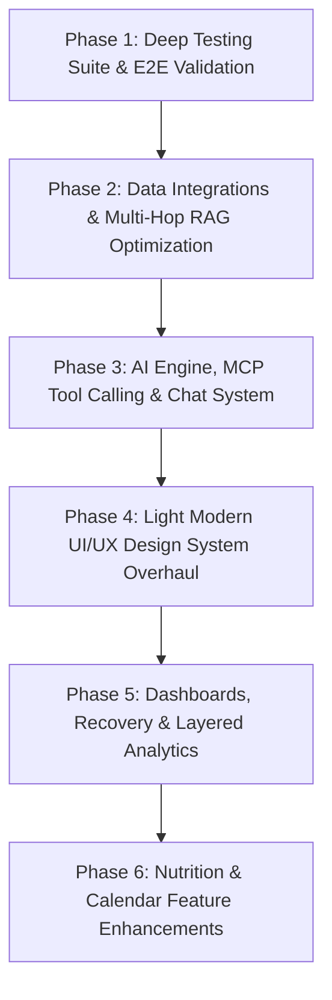

# GYMBro Comprehensive System Overhaul & Roadmap Design

**Date:** 2026-08-09  
**Status:** Approved  

---

## Executive Summary
This design document defines the architectural and functional roadmap for overhauling the **GYMBro** autonomous AI athletic coach application. Based on user feedback ([feedback.txt](file:///Users/davidmcinnis/codes/gymbro/feedback.txt)), the platform requires improvements across testing automation, data sync, multi-hop RAG context, chat tool-calling UI, UI design system aesthetics, interactive analytics, and specialized nutrition/calendar features.

---

## System Architecture & Phased Implementation Breakdown

---

### Phase 1: Deep Testing Suite & E2E Validation
- **Synthetic User Generator**: Scriptable mock user profiles (e.g. beginner runner, bodybuilder, triathlete).
- **Multi-channel Ingestion Tests**: Automated testing for PDF bloodwork uploads, manual journal entries, Garmin/Strava syncs.
- **Regression Suite**: Pytest backend test harness checking database persistence, API route sanity, and mock LLM tool calling response validity.

---

### Phase 2: Data Integration & Multi-Hop RAG Optimization
- **OAuth Callback Fixes**: Fix Strava OAuth callback handler to cleanly return authentication code back to Expo mobile deep links.
- **Auto-Sync Pipeline**: Background synchronization job for Strava, Garmin, and Apple Fitness data ingestion.
- **RAG Multi-Hop Architecture**:
  - Vector index optimization for health notes, journal logs, and bloodwork PDF embeddings.
  - Hybrid retrieval combining SQL relational metadata (activities, dates) with vector similarity (user preferences, notes).

---

### Phase 3: AI Engine, MCP Tool Calling & Chat Overhaul
- **Structured Tool Output**: Chat response parser emitting UI action payloads (e.g. render chart, render workout preview).
- **Training Plan Generator**: AI chat flow producing structured JSON multi-day workout routines that auto-populate the workout calendar.
- **Chat Management**: Multi-session support allowing creation, switching, and deleting of chat windows.
- **Interview Archetype Polish**: Clean transition through user onboarding interviews without repetitive prompts.

---

### Phase 4: Light Modern UI/UX Design System Overhaul
- **Design Tokens**: Replace dark & purple palette with a clean, light, modern, simplistic, and motivating palette (slate/amber/emerald accents).
- **Navigation Structure**: Streamlined 5 bottom navigation tabs:
  1. `Today / Feed`
  2. `Training & Calendar`
  3. `Coach Chat`
  4. `Recovery & Insights`
  5. `Profile & Settings`
- **Chat Micro-interactions**: Clean status indicators without blocking UI states or redundant prompt buttons.

---

### Phase 5: Dashboards, Recovery & Layered Analytics
- **Interactive Layered Charts**: Flexible chart components allowing visual comparison of HRV, sleep quality, heart rate, and training load trends.
- **PR Auto-Detection**: Pipeline extracting Personal Records from activity data, prompting user for review/updates on the Athlete Dashboard.
- **Editable Profile**: Clear inline editing for user attributes, target metrics, and custom Coach naming.

---

### Phase 6: Nutrition & Calendar Feature Enhancements
- **Nutrition Upgrades**:
  - AI photo scan item editing with dynamic macro/calorie re-estimation.
  - Dynamic macro goal calculator factoring in age, bodyweight, activity level, and goal archetype.
  - Daily food history log.
- **Calendar Upgrades**:
  - Multiple calendar views (Agenda, Weekly, Monthly).
  - AI context prompts when manual events (e.g. lifting sessions) are missing exercise/set details.

---

## Verification Plan

### Automated Testing
- `pytest tests/` for backend API, RAG retrieval, and auth verification.
- `npm test` / typecheck on Expo frontend app.

### Manual Verification
- Verify Expo mobile app UI rendering on iOS simulator / device.
- Verify OAuth handshake flow and chat workout plan generation.
